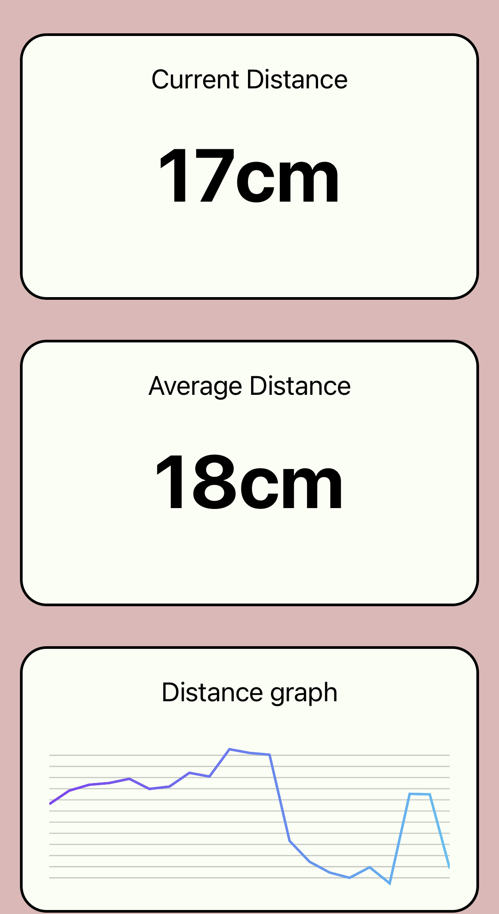

### Eyeshield is an app that helps you avoid holding your phone too close to your face.
<i>Created by Shashwat Kansal, Manuj Mishra, Jack Qiu, Gavin Wu, and Thomas Christie</i>.
********************************

  

Eyeshield uses React Native, which can be used on all major platforms like iOS, Android and the Web. It gives realtime data analytics like dynamic graphs so that the user can find out more about their phone usage and take care of their health.

